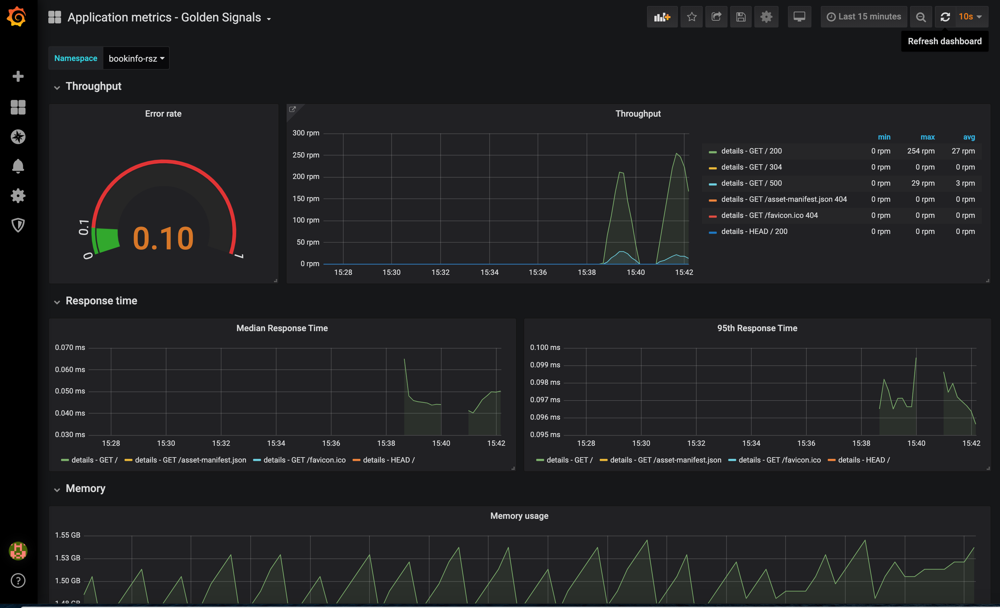

# Activity 2

In the following exercise we will add Observability features to our `bookinfo-details-v2` Node.js microservice.

## Metrics instrumentation
Observability should always be top of mind when you’re developing new apps or refactoring existing ones. Maintaining a common layer of baseline metrics that applies to all apps and infrastructure while incorporating custom metrics is extremely desirable.
One of the most important decisions to make when setting up web application monitoring is deciding on the type of metrics you need to collect about your app. The metrics you choose simplifies troubleshooting when a problem occurs and also enables you to stay on top of the stability of your services and infrastructure.

The [RED method](https://www.weave.works/blog/the-red-method-key-metrics-for-microservices-architecture/) follows on the principles outlined in the [Four Golden Signals](https://landing.google.com/sre/book/chapters/monitoring-distributed-systems.html#xref_monitoring_golden-signals) developed by Site Reliability Engineers, which focuses on measuring things that end-users care about when using your web services. With the RED method, three key metrics are instrumented that monitor every microservice in your architecture:

- (Request) Rate - the number of requests, per second, your services are serving.
- (Request) Errors - the number of failed requests per second.
- (Request) Duration - The amount of time each request takes expressed as a time interval.

Rate, Errors and Duration attempt to cover the most obvious web service issues. These metrics also capture an error rate that is expressed as a proportion of request rate.


[Prom-client](https://github.com/siimon/prom-client) Prometheus client library is designed to collect metrics from Node.js applications and expose them to Prometheus. You can begin to capture default metrics such as memory and heap size just by calling `collectDefaultMetrics`.

Here’s how to enable prom-client in your Node.js app’s source code to expose default application metrics: 
```js
const client = require('prom-client');
const collectDefaultMetrics = client.collectDefaultMetrics;
```

In our exercise, beside default set of metrics related to Node.js runtime, we will also collect histogram metric `http_request_duration_seconds` which allow to calculate all RED method metrics. A histogram provides a statistical breakdown of possible results of an event using a set of buckets. For each request, we will monitor the response time and increment the counter of a corresponding histogram bucket. 

Due to the asynchronous nature of Node.js, it can be tricky deciding where to place instrumentation logic to start or stop the application response timers required by a histogram. Luckily, when you use the Express framework for Node.js web apps, `express-prom-bundle` dramatically simplifies this process. Internally, `express-prom-bundle` uses `prom-client`.

You can install this library for your use with this command: `npm install express-prom-bundle prom-client --save`

After adding the following code to `app.js`, the default set of Node.js runtime metrics and all routes or paths registered with the framework will be measured using `http_request_duration_seconds` histogram:

```js
const promBundle = require("express-prom-bundle");

const metricsMiddleware = promBundle({
    includeMethod: true,
    includePath: true,
    promClient: {
        collectDefaultMetrics: {
        }
    }
});

app.use(metricsMiddleware);
```

## Logging
Logs provide visibility into the behavior of a running app, they are one of the most fundamental tools for debugging and finding issues within your application. If structured correctly, logs can contain a wealth of information about a specific event. Logs can tell us not only when the event took place, but also provide us with details as to the root cause. Therefore, it is important that the log entries are readable to humans and machines. 

According to the [12-factor](https://12factor.net/) application guidelines, logs are the stream of aggregated, time-ordered events. A twelve-factor app never concerns itself with routing or storage of its output stream. It should not attempt to write to or manage log files. Instead, each running process writes its event stream, unbuffered, to stdout. If you deviate from these guidelines, make sure that you address the operational needs for log files, such as logging to local files and applying log rotation policies.

 In this exercise we’ll focus on a logging package called `Winston`, an extremely versatile logging library and the most popular logging solution available for Node.js applications, based on NPM download statistics. Winston’s features include support for multiple storage options and log levels, log queries, and even a built-in profiler.

Review the src/app.js and look for the following code. This is how we defined our `logger`.

```js
const { createLogger, format, transports } = require('winston')
```


```js
const logger = createLogger({
  level: 'debug',
  format: format.combine(
    format.timestamp({
      format: "YYYY-MM-DD'T'HH:mm:ss.SSSZ"
    }),
    format.json()
  ),
  transports: [new transports.Console()]
});
```

The configuration above specifies timestamp field format and enables sending logs in `json` format to STDOUT.
Timestamp should include the time zone information and be precise down to milliseconds. 
When specifying a logging level for a particular transport, anything at that level or higher will be logged. For example, by specifying a level of `info`, anything at level error, warn, or info will be logged. Log levels are specified when calling the logger, meaning we can do the following to record an error: `logger.error('test error message')`.

## Instructions

1. Start by opening a terminal in a workspace directory of your choosing (*for example, on windows - C:\ibm-garage but it can be anything you'd like*)

2. In the same terminal, navigate to the directory `bookinfo-details/activity2`

3. Review the changes in `src/app.js`. Identify the code related to metrics and logging. Note we added simulated errors and small random delay to each request. 
4. (Optional) If you have local installation of Docker on your workstation, try to build the docker image for our `bookinfo-details-v2` microservice. Review the contents of the `Dockerfile` needed to build the image. Run the following command to build the image:
   ```sh
   cd bookinfo-details/activity2
   docker build -t bookinfo-details-v2:1.0 .
   ```
   After it completes list the local docker images:
   ```
   docker images
   ```
   It should list the image you have just built.
   Run the docker container locally in order to test if it works correctly:

   ```
   # docker run -d -p 3000:3000 --name bookinfo-details-v2 bookinfo-details-v2:1.0
   docker run -p 3000:3000 --name bookinfo-details-v2 bookinfo-details-v2:1.0
   ```
   Use curl or web browser and test microservice URLs:
   - `http://localhost:3000`
   - `http://localhost:3000/metrics`


5. Push the image to the registry. In order to get the image available for the cluster the image should be pushed up. Remember to use naming convention agreed example: `docker.io/<repos>/<id>-bookinfo-details-v2:1.0`  or `de.icr.io/<namespace>/<id>-bookinfo-details-v2:1.0`
Example run:
   ```
   docker tag  bookinfo-details-v2:1.0 de.icr.io/<namespace>/<id>-bookinfo-details-v2:1.0

   docker push de.icr.io/<namespace>/<id>-bookinfo-details-v2:1.0
   ```


6. Review the changes to `openshift/deployment.yaml` and `openshift/service.yaml`.

  **Changes to `openshift/deployment.yaml`**  
   The following config has been added in the `spec.template.spec.containers` section:

   ```yaml
             env:
             - name: LOG_LEVEL
               value: "debug"
   ```
   This is an environment variable definition that specifies the logging level for `bookinfo` microservice. You can change it anytime in order to set the desired logging level.
   We changed also the container image name to the one we previously uploaded to Docker Hub (or IBM Container Registry).

   **Changes to `openshift/service.yaml`**
   The following config has been added in the `metadata:` section:

   ```yaml
     labels:
       name: app-metrics-label
   ```
   This label will be used by Prometheus to automatically add the `bookinfo-details-v2` microservice to the scope of monitoring.

7. Re-deploy the deployment to your namespace

   ```bash
   oc project bookinfo-mn/activity2

   oc apply -f openshift/deployment.yaml
   oc apply -f openshift/service.yaml
   ```
8. Temporarily create an external route to the bookinfo-details-v2 service in order to verify that metrics are properly exposed. (Or do a port-forwarding, but remember to cleanup the route if created :-) )

    ```sh
    oc expose svc details-v2
    oc get route
    ```
    Use the URL from the output of 2nd command and check it with curl or web browser.

    Access the `http://<route_host>/metrics`
    and verify if the output is similar to:

   ```
   # HELP process_cpu_user_seconds_total Total user CPU time spent in seconds.
   # TYPE process_cpu_user_seconds_total counter
   process_cpu_user_seconds_total 126.29242099999999

   # HELP process_cpu_system_seconds_total Total system CPU time spent in seconds.
   # TYPE process_cpu_system_seconds_total counter
   process_cpu_system_seconds_total 146.13573399999999

   (...)


   # HELP http_request_duration_seconds duration histogram of http responses labeled with: status_code, method, path
   # TYPE http_request_duration_seconds histogram
   http_request_duration_seconds_bucket{le="0.003",status_code="200",method="GET",path="/"} 6
   http_request_duration_seconds_bucket{le="0.03",status_code="200",method="GET",path="/"} 7
   http_request_duration_seconds_bucket{le="0.1",status_code="200",method="GET",path="/"} 7
   http_request_duration_seconds_bucket{le="0.3",status_code="200",method="GET",path="/"} 7
   http_request_duration_seconds_bucket{le="1.5",status_code="200",method="GET",path="/"} 7
   http_request_duration_seconds_bucket{le="10",status_code="200",method="GET",path="/"} 7
   http_request_duration_seconds_bucket{le="+Inf",status_code="200",method="GET",path="/"} 7
   http_request_duration_seconds_sum{status_code="200",method="GET",path="/"} 0.025610142000000002
   http_request_duration_seconds_count{status_code="200",method="GET",path="/"} 7
   http_request_duration_seconds_bucket{le="0.003",status_code="404",method="GET",path="/favicon.ico"} 0
   http_request_duration_seconds_bucket{le="0.03",status_code="404",method="GET",path="/favicon.ico"} 1
   http_request_duration_seconds_bucket{le="0.1",status_code="404",method="GET",path="/favicon.ico"} 1
   http_request_duration_seconds_bucket{le="0.3",status_code="404",method="GET",path="/favicon.ico"} 1
   http_request_duration_seconds_bucket{le="1.5",status_code="404",method="GET",path="/favicon.ico"} 1
   http_request_duration_seconds_bucket{le="10",status_code="404",method="GET",path="/favicon.ico"} 1
   http_request_duration_seconds_bucket{le="+Inf",status_code="404",method="GET",path="/favicon.ico"} 1
   http_request_duration_seconds_sum{status_code="404",method="GET",path="/favicon.ico"} 0.003525823
   http_request_duration_seconds_count{status_code="404",method="GET",path="/favicon.ico"} 1
   http_request_duration_seconds_bucket{le="0.003",status_code="304",method="GET",path="/"} 39
   http_request_duration_seconds_bucket{le="0.03",status_code="304",method="GET",path="/"} 44
   http_request_duration_seconds_bucket{le="0.1",status_code="304",method="GET",path="/"} 44
   http_request_duration_seconds_bucket{le="0.3",status_code="304",method="GET",path="/"} 44
   http_request_duration_seconds_bucket{le="1.5",status_code="304",method="GET",path="/"} 44
   http_request_duration_seconds_bucket{le="10",status_code="304",method="GET",path="/"} 44
   http_request_duration_seconds_bucket{le="+Inf",status_code="304",method="GET",path="/"} 44
   http_request_duration_seconds_sum{status_code="304",method="GET",path="/"} 0.107069568
   http_request_duration_seconds_count{status_code="304",method="GET",path="/"} 44

   # HELP up 1 = up, 0 = not up
   # TYPE up gauge
   up 1
   ```

9. View logs generated by the `bookinfo-details-v2` app.
   
  - Collect the pod name with `oc get pod`
  - View logs using `oc logs <pod_name>`
   The output should be similar to:
  ```
  > bookinfo-details@1.0.0 start /app
  > node src/server.js

  Details service has started on port 3000
  {"errCode":"DET00001I","level":"info","message":"Hello World!","timestamp":"2020-05-12T16:39:23.246Z"}
  {"errCode":"DET00001I","level":"info","message":"Hello World!","timestamp":"2020-05-12T16:39:27.275Z"}
  {"errCode":"DET00001I","level":"info","message":"Hello World!","timestamp":"2020-05-12T16:39:28.120Z"}
  {"errCode":"DET00001I","level":"info","message":"Hello World!","timestamp":"2020-05-12T16:39:28.591Z"}
  ```

## View results in Prometheus and Grafana

Prometheus and Grafana stack has been pre-configured on our ROKS cluster. It should automatically detect your instrumented `bookinfo-details` microservice.
Collect the Grafana URL using command:
```
$ echo https://`oc get route grafana-route -o jsonpath={.spec.host} -n app-monitoring-1`

https://grafana-route-app-monitoring-1.roks-bootcamp-194290-7cb1e9f279ecbad5dd278bca741c81b3-0000.eu-de.containers.appdomain.cloud
```
Open the "NodeJS Application Dashboard". It is based on default set of metics collect for Node.js runtime by Prometheus client library


Another dashboard "Application Metrics - Golden Signals" visualize Request Rate, Error Rate and Request Duration in percentiles.



Generate load for the `bookinfo-details` and observe results on the dashboard.

## View results in Sysdig

Open Sysdig Console `https://cloud.ibm.com/observe/monitoring` and click `View Sysdig`
Click on the `Explore` icon on the task bar and select `Services`. Expand the cluster branch and locate your namespace `bookinfo-xxx` and the from the dropdown list above the charts select `Default dashboards -> Services -> Kubernetes Service Golden Signals`. See the screenshot below for additional guidance how to find this dashboard.


## View results in LogDNA

Open LogDNA Console `https://cloud.ibm.com/observe/logging` and and click `View LogDNA`

Type the following search query in order to view all logs coming from resources located in your namespace: `namespace:bookinfo-xxx`


Try to create a similar dashboard showing the message count in time as on the screenshot below:

